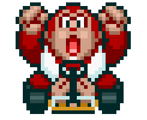

<div align="center">
  <a href="#">
      
  </a>

  <h1 align="center">Mario Kart Race Simulator (Improved Version)</h1>

  <p align="center">
    A <b>Node.js</b> terminal-based Mario Kart race simulator.
    <br />
    <a href="https://github.com/ismaelldiias/nodejs-mario-kart-race-simulator/issues">Report Bug</a>
    ·
    <a href="https://github.com/ismaelldiias/nodejs-mario-kart-race-simulator/issues/new">Request Feature</a>
  </p>
</div>

## 📌 About the Project

This project was developed during the **Node.js Fundamentals** training by [Digital Innovation One (DIO)](https://www.dio.me/).

As part of the course, instructor [Felipe Aguiar](https://github.com/felipeAguiarCode) introduced the challenge **"Mario Kart Race Simulator with Node.js"**, a fun exercise focused on practicing back-end logic and JavaScript programming through a terminal-based game.

This repository builds upon the instructor’s base project, expanding it with my own improvements and additional features.

---

## 🎯 Objective

Mario Kart is a popular racing game series developed and published by Nintendo. The challenge of this project was to create the **core game logic** to simulate Mario Kart races, taking into account the rules and mechanics described below.

---

## 🕹️ Original Rules & Mechanics

<div align="center">
<table style="border-collapse: collapse; margin: 0 auto;">
  <caption style="caption-side: top; font-weight: bold; font-size: 1.2em; padding: 8px;">
    Available Characters
  </caption>
        <tr>
            <td style="border: 1px solid black; text-align: center;">
                <p>Mario</p>
                
            </td>
            <td style="border: 1px solid black; text-align: center;">
                <p>Speed: 4</p>
                <p>Handling: 3</p>
                <p>Power: 3</p>
            </td>
             <td style="border: 1px solid black; text-align: center;">
                <p>Peach</p>
                
            </td>
            <td style="border: 1px solid black; text-align: center;">
                <p>Speed: 3</p>
                <p>Handling: 4</p>
                <p>Power: 2</p>
            </td>
              <td style="border: 1px solid black; text-align: center;">
                <p>Yoshi</p>
                
            </td>
            <td style="border: 1px solid black; text-align: center;">
                <p>Speed: 2</p>
                <p>Handling: 4</p>
                <p>Power: 3</p>
            </td>
        </tr>
        <tr>
            <td style="border: 1px solid black; text-align: center;">
                <p>Bowser</p>
                
            </td>
            <td style="border: 1px solid black; text-align: center;">
                <p>Speed: 5</p>
                <p>Handling: 2</p>
                <p>Power: 5</p>
            </td>
            <td style="border: 1px solid black; text-align: center;">
                <p>Luigi</p>
                
            </td>
            <td style="border: 1px solid black; text-align: center;">
                <p>Speed: 3</p>
                <p>Handling: 4</p>
                <p>Power: 4</p>
            </td>
            <td style="border: 1px solid black; text-align: center;">
                <p>Donkey Kong</p>
                
            </td>
            <td style="border: 1px solid black; text-align: center;">
                <p>Speed: 2</p>
                <p>Handling: 2</p>
                <p>Power: 5</p>
            </td>
        </tr>
    </table>

</div>
<br>

- The computer must receive **two characters** to compete (each represented by an object).  
- Races take place over **5 rounds**.  
- In each round, a **track segment** is randomly selected, which can be:
  - **Straight** → roll a dice (1–6) and add the **Speed** attribute.  
    The winner earns **1 point**.
  - **Curve** → roll a dice (1–6) and add the **Handling** attribute.  
    The winner earns **1 point**.
  - **Battle** → roll a dice (1–6) and add the **Power** attribute.  
    The loser **loses 1 point**.
- No player can have a negative score.  
- After all 5 rounds, **the player with the highest score wins**.

---

## 💡 Improvements

The following improvements were implemented based on the instructor’s original project:

- The user now receives a complete list of all available characters and chooses which ones will race, as well as how many rounds the race will have. Validation was added to prevent invalid or repeated selections for both character choice and number of rounds.
- In the **Battle** track, the winner may randomly receive a **turbo bonus** (+1 point). The loser may lose **1 or 2 points**, depending on the item drawn (**shell** or **bomb**).
- UI improvements: use of visual separators, varied emojis, and clearer messages for each situation.
- Cleaned up unnecessary code.

---

## 🛠 Technologies

- [Node.js](https://nodejs.org)

## 🚀 Building

You'll need [Node.js](https://nodejs.org) installed on your computer in order to build this app.

```bash
git clone https://github.com/ismaelldiias/nodejs-mario-kart-race-simulator.git
$ cd nodejs-mario-kart-race-simulator
$ npm install
```

## 💻 Usage

🔧 Run the script

```bash
$ npm run start
```

## ✨ Authors

| Original Author | Maintainer & Improvements |
|:---------------:|:-------------------------:|
| [<br><sub>Felipe Aguiar</sub>](https://github.com/felipeAguiarCode)<br>[LinkedIn](https://www.linkedin.com/in/felipe-aguiar-exe) | [<br><sub>Ismael Dias</sub>](https://github.com/ismaelldiias)<br>[LinkedIn](https://www.linkedin.com/in/ismaelldiias/) |
